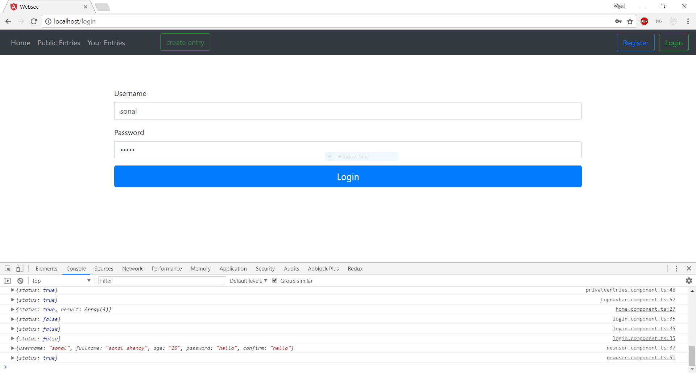
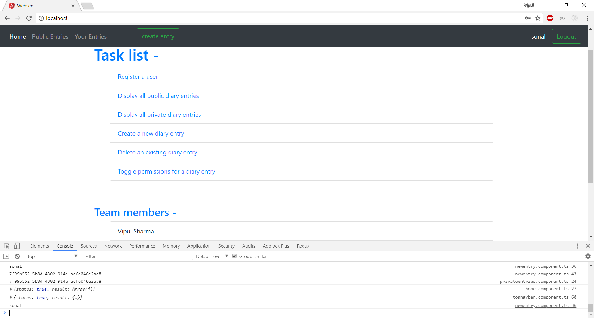
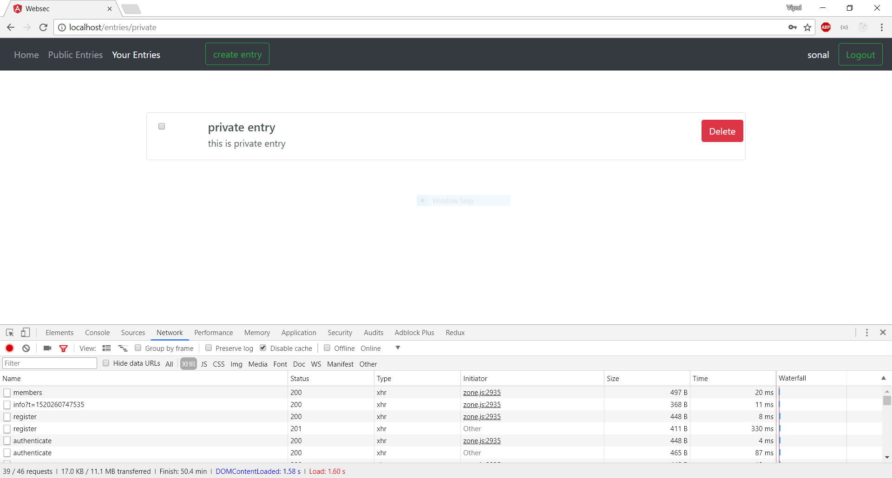
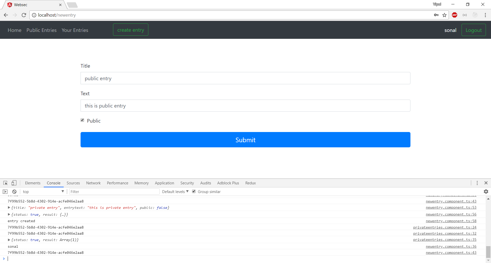
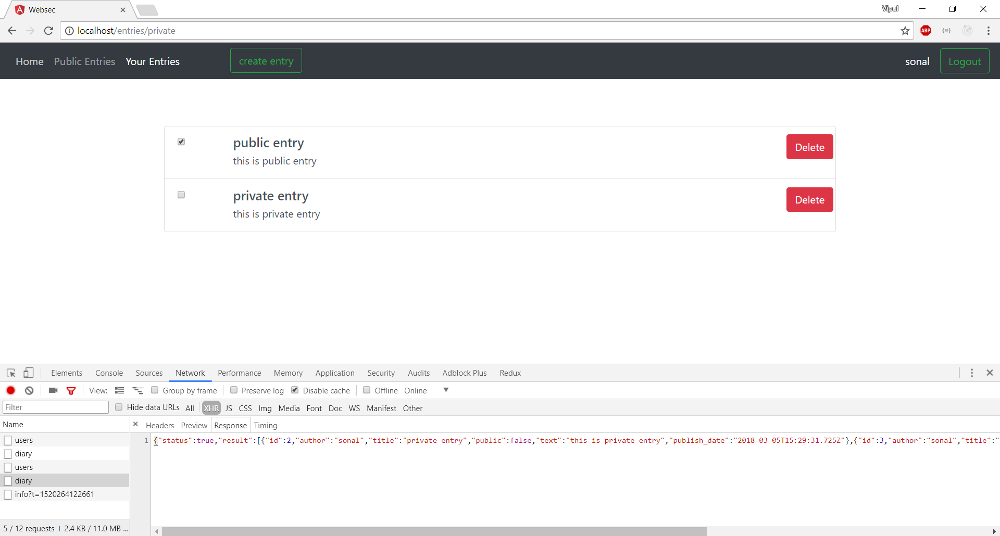
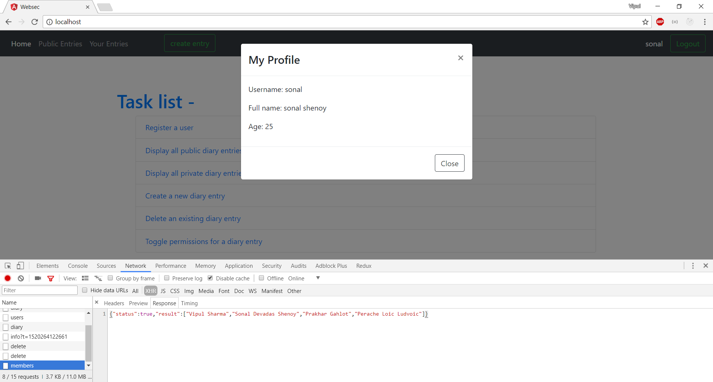
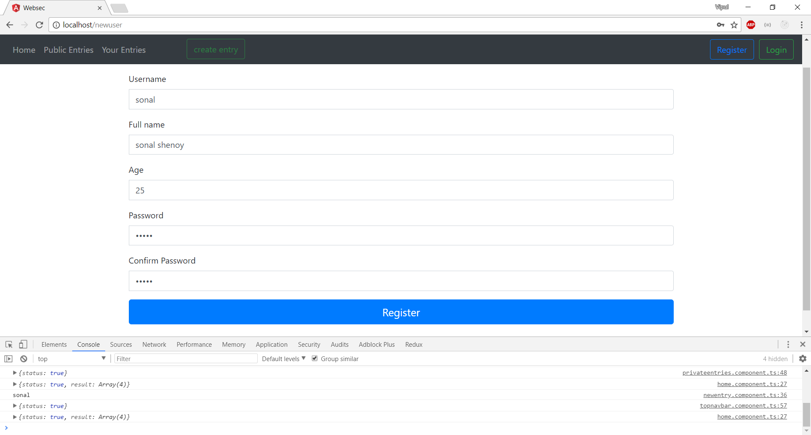
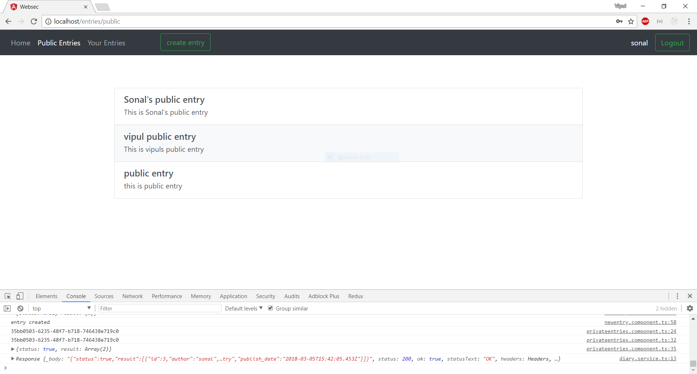

# rest-api-development

CS5331 Assignment 1 Project Reference Repository

## Instructions

Your objective is to implement a web application that provides the endpoints
specified here: https://cs5331-assignments.github.io/rest-api-development/.

The project has been packaged in an easy to set-up docker container with the
skeleton code implemented in Python Flask. You are not restricted in terms of
which language, web stack, or database you desire to use. However, please note
that very limited support can be given to those who decide to veer off the
beaten path.

You may be required to modify the following files/directories:

- Dockerfile - contains the environment setup scripts to ensure a homogenous
  development environment
- src/ - contains the front-end code in `html` and the skeleton Flask API code
  in `service`
- img/ - contains images used for this README

Assuming you're developing on an Ubuntu 16.04 machine, the quick instructions
to get up and running are:

```
# Install Docker

sudo apt-get update
sudo apt-get install \
    apt-transport-https \
    ca-certificates \
    curl \
    software-properties-common
curl -fsSL https://download.docker.com/linux/ubuntu/gpg | sudo apt-key add -
sudo add-apt-repository \
   "deb [arch=amd64] https://download.docker.com/linux/ubuntu \
   $(lsb_release -cs) \
   stable"
sudo apt-get update
sudo apt-get install docker-ce

# Verify Docker Works

sudo docker run hello-world

# Run the skeleton implementation

sudo ./run.sh
```

(Docker CE installation instructions are from this
[link](https://docs.docker.com/install/linux/docker-ce/ubuntu/#install-using-the-repository).)

**Please consult your assignment hand-out for detailed setup information.**

## Grading

The implementation will be graded in an automated fashion on an Ubuntu 16.04
virtual machine by building the docker container found in your repository and
running it. The grading script will interact with your API.

The following ports are expected to be accessible:

1. 80, on which static HTML content, including the front-end, is served.
2. 8080, on which the API is exposed.

To verify this, please run the following commands:

```
sudo ./run.sh
```

On a different window:

```
curl http://localhost:80
curl http://localhost:8080
```

If a response is received, you're good to go.

**Please replace the details below with information relevant to your team.**

## Screenshots

Please replace the example screenshots with screenshots of your completed
project. Feel free to include more than one.

















## Administration and Evaluation

Please fill out this section with details relevant to your team.

### Team Members

1. Vipul Sharma
2. Sonal Devadas Shenoy
3. Prakhar Gahlot
4. Perache Loic Ludvoic

### Short Answer Questions

#### Question 1: Briefly describe the web technology stack used in your implementation.

MEAN is the free and open source Javascript web technology stack used in our application. It stands for Mongo, Express, Angular and Node.js.
1. Mongo DB is a free and open-source cross-platform document-oriented database program. It is a NoSQL database program, which means it does not depend on MySQL and SQL-like entries for querying. Instead, it uses schemas that have JSON-like structure in the collections(tables). Mongo, additionally, automatically creates a uniqe string for each entry created, and returns it. 
2. Express.js is a free and open source web application framework which aims to automate the overhead associated with common web development activities, such as libraries for database access, and templating frameworks. It is the standard framework for Node.js.
3. AngularJs  is the JavaScript-based open-source frontend web-application counterpart of the stack. The AngularJS framework works by first reading the HTML page, which has additional custom tag attributes embedded into it. Angular interprets those attributes as directives to bind input or output parts of the page to a model that is represented by standard JavaScript variables. The values of those JavaScript variables can be manually set within the code, or retrieved from static or dynamic JSON resources.
4. Node.js is the foundational element of the "Javascript Everywhere" paradigm. It is the open-source platform used to run JavaScript code on the server. It enables the JavaScript which was in the past used only on clients to be used to serve dynamic content by generating pages, and serving them to the web-clients.

#### Question 2: Are there any security considerations your team thought about?

1. MongoDB is immune to SQL injection-type attacks. It's not succeptible to SQL-language abuses.
2. Latest versions of Node and Express were used which addressed many vulnerabilities in previous versions. 

#### Question 3: Are there any improvements you would make to the API specification to improve the security of the web application?

1. We think a better token-management strategy is needed. If the user closes the browser without logging out, the token remains alive in the database. This is a potential security vulnerability, especially if an attacker can discover the token. A time-based or similar token-expiry is needed.

#### Question 4: Are there any additional features you would like to highlight?

1. The app is quite light-weight, because jQuery is not needed by the app, and hence not implemented. It usually contributes to a bigger size of a web application.
2. JWT was implemented to store session data in client-side cookies, but the feature was turned off because of non-compliance with the specification. JWT is a more secure way of storing session information while keeping the server stateless.

#### Question 5: Is your web application vulnerable? If yes, how and why? If not, what measures did you take to secure it?

The application uses broser storage instead of cookies to store the token on the client side. This is readable by Javascript, and hence succeptible ot XSS attacks.

#### Feedback: Is there any other feedback you would like to give?

A suggestion would be to make the testing system more flexible so that cutting edge technologies like MongoDB can provide uuid's instead of integers as primary tokens.
That said, this assignment helped us understand the basics of web development and what goes in to make a workable web implementation.

### Declaration

#### Please declare your individual contributions to the assignment:

1. Member 1 Perache Loic Ludvoic
    - Database Setup and Implementation
2. Member 2 Sonal Devadas Shenoy
    - Implemented the front-end code
3. Member 3 Name Vipul Sharma
    - Implemented the RESTful web services on Node.js 
4. Member 4 Name Prakhar Gahlot
    - Integrated the Database and Backend.
    - Wrote the Documentation.
